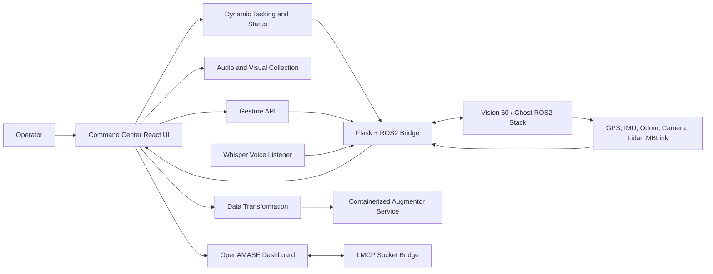

# High-Level System Architecture (HSLA)

## System context

## Major components

### Command Center UI

The React application provides task entry, task status, telemetry, mission controls, sensor results, maps, camera feeds, and point-cloud views. Runtime service locations are supplied through local environment configuration.

### Dynamic tasking

User-initiated commands enter through the Tasking or ROS2 Agents pages. The target lifecycle is:

1. `queued`: backend accepted the task.
2. `doing`: robot mission or action is active.
3. `done`: backend reported completion or the operator closed the task.

Mission status from the robot backend is authoritative. Browser history is an operator aid, not the source of truth.

### Flask + ROS2 bridge

The bridge translates HTTP requests into ROS2 publications/services and exposes robot telemetry to browser clients. It handles motion, safety actions, mission control, cameras, lidar, localization, map management, diagnostics, and point clouds.

### Point-cloud transport

Raw lidar clouds can be transmitted as JSON or packed after Hilbert space-filling curve ordering. The UI records payload size and timing metrics and renders the decoded cloud with Three.js.

### Alternative controls

- Voice Control converts microphone audio to text with Whisper, maps intent, and calls the robot API.
- Gesture Control uses RTMDet and MMPose WholeBody on a GPU laptop, then sends stabilized gesture commands to the same API.

### Supporting services

- Augmentor service: image transformation on port `5000`.
- Gesture API: local process control on port `7001`.
- LMCP bridge: simulation events on port `5001`.

## Trust boundaries

- Browser configuration is public and must not contain secrets.
- Robot APIs should remain on a trusted network or behind authenticated access controls.
- Motion commands require physical safety controls independent of the web UI.
- Deployment addresses and credentials belong in ignored local configuration, not source code.
